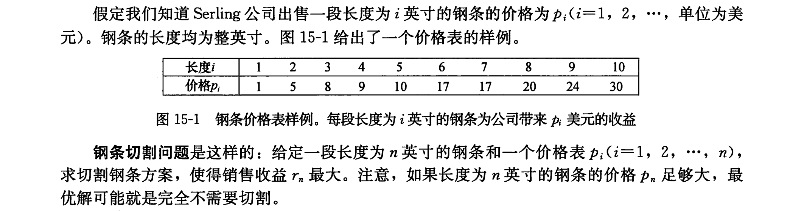
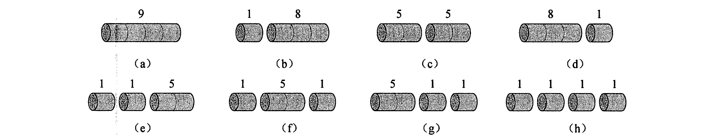
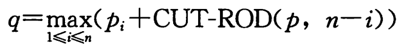

## 第15章 动态规划

### 15.1 钢条切割问题

1.问题描述

2.视频：[动态规划6-钢条切割问题](https://www.bilibili.com/video/BV1oU4y1r7gF/?spm_id_from=333.337.search-card.all.click&vd_source=53a8c726503d3ac9f6d68911fe515164)

只能切一刀，可以在距离左端的 $i$ 英寸处切割。

3.题解：

- 分治递归求解法
- 自顶向下法
- 自底向上法

### 15.2 矩阵链式乘法

